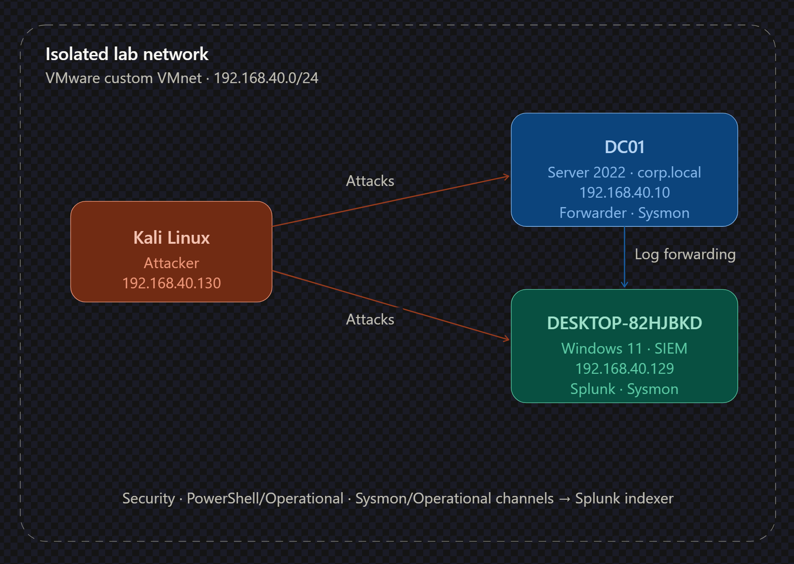

# Lab Architecture

## Overview

An isolated virtual lab built in VMware Workstation on a single host, using a
custom (host-only style) VMnet so no lab traffic reaches the physical network.
The lab simulates Active Directory attacks and centralises Windows logs in
Splunk for detection.

## Hosts

| Role               | Hostname        | OS                  | IP             | Key Software                                                     |
| ------------------ | --------------- | ------------------- | -------------- | ---------------------------------------------------------------- |
| Domain Controller  | DC01            | Windows Server 2022 | 192.168.40.10  | AD DS, DNS, Splunk Universal Forwarder, Sysmon                   |
| Workstation / SIEM | DESKTOP-82HJBKD | Windows 11          | 192.168.40.129 | Domain-joined, Splunk Enterprise (indexer + search head), Sysmon |
| Attacker           | kali            | Kali Linux          | 192.168.40.130 | Kerbrute, CrackMapExec, Impacket, Evil-WinRM, Hashcat            |

Domain: `corp.local`
Network: VMware custom VMnet, 192.168.40.0/24 (isolated)

## Logging Pipeline

1. The **Splunk Universal Forwarder** on DC01 collects Windows event logs and
   forwards them to the Splunk Enterprise indexer on the Windows 11 host.
2. Forwarded channels include the **Security** log, the **PowerShell/Operational**
   channel, and the **Sysmon/Operational** channel.
3. **Sysmon** is deployed on both the DC and the workstation for process-creation
   telemetry (Event ID 1).
4. Detection queries are run on the Windows 11 Splunk instance against the
   forwarded data.

## Logging Configuration Notes

- **Audit policies** were enabled to generate the relevant security events
  (account management, logon, directory service access).
- A temporary **account lockout policy** was set to trigger Event 4740 during
  the brute-force scenario.
- **PowerShell Script Block Logging** (Event 4104) was enabled via Group Policy.
- The PowerShell Operational channel was added to the forwarder's `inputs.conf`
  and routed to a dedicated index, as it is not forwarded by default.
- **Sysmon** provides process lineage (parent/child, command line, hashes) that
  complements the native Windows logs.
