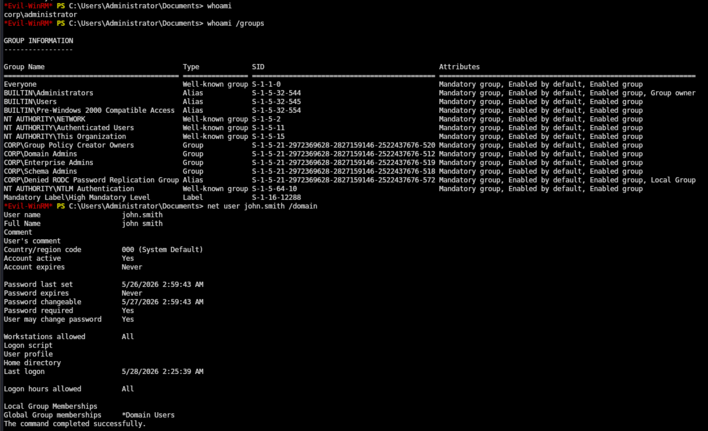
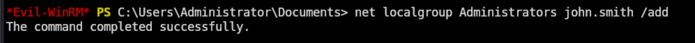
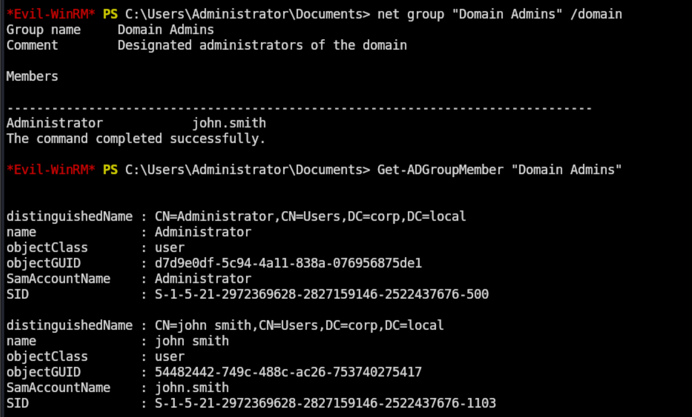
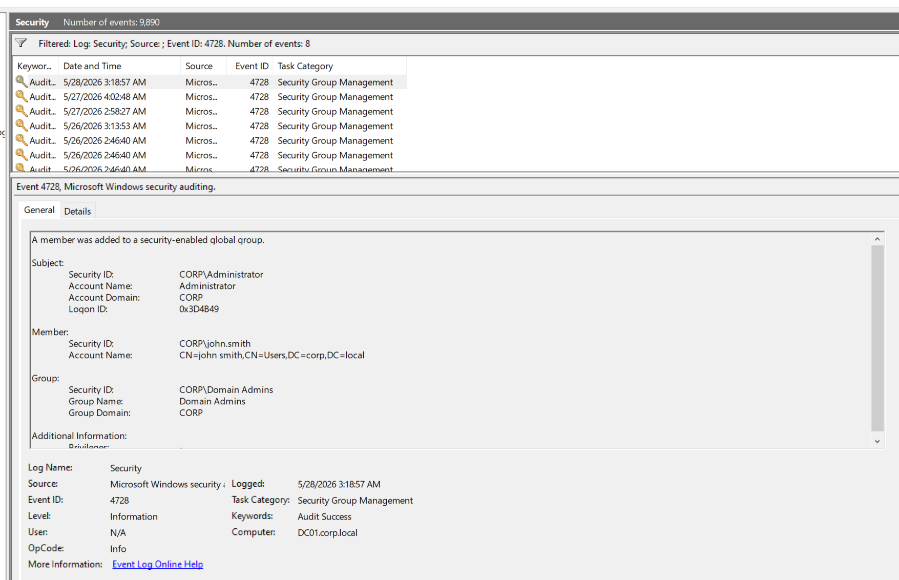
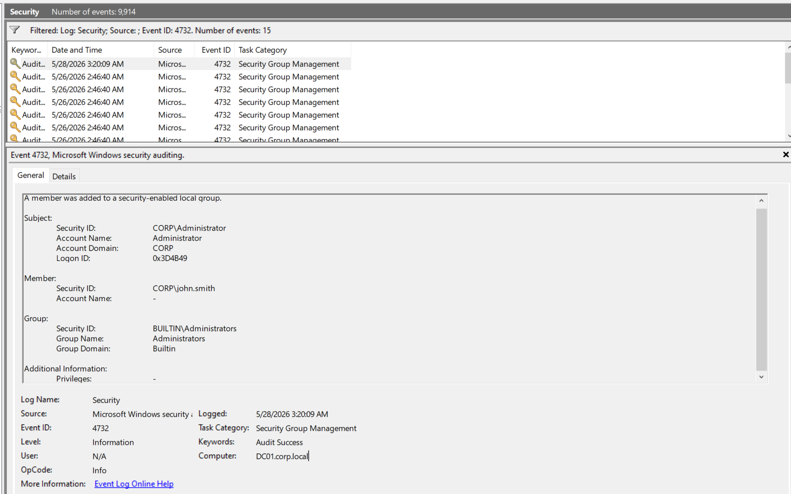
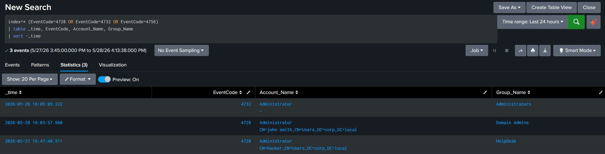

# Additional Local/Domain Groups

A privilege-escalation and persistence technique. Adding an existing user to a privileged group (Domain Admins, local Administrators) grants high access without needing to create a new account. The two variants (domain global vs. local) fire different events, which is why both are tested here.

## MITRE ATT&CK Mapping (TTPs)

| Tactic               | Technique              | ID        |
| -------------------- | ---------------------- | --------- |
| Privilege Escalation | Account Manipulation   | T1098     |
| Persistence          | Account Manipulation   | T1098     |
| Lateral Movement     | Remote Services: WinRM | T1021.006 |

## Attack

### Step 1: Connect via Evil-WinRM (T1021.006)

Remote shell on the DC as Administrator:

```bash
evil-winrm -i 192.168.40.10 -u Administrator -p 'admin@123'
```


### Step 2: Baseline check

`whoami /groups` was run to confirm the current session's privileges before modifying anything. The session is running as Administrator with Domain Admins, Enterprise Admins, and Schema Admins in its token, which is what makes the next step possible.

```powershell
whoami
whoami /groups
```



### Step 3: Add john.smith to Domain Admins (T1098)

```powershell
net group "Domain Admins" john.smith /add /domain
```

Returned `The command completed successfully`. john.smith is now a member of the most privileged group in the domain.


### Step 4: Add john.smith to local Administrators (T1098)

```powershell
net localgroup Administrators john.smith /add
```

This is the local-group variant. Local Administrators on the DC is functionally similar to Domain Admins here, but generates a different event (4732 instead of 4728), which is the reason to test both paths.



### Step 5: Verify membership

```powershell
net group "Domain Admins" /domain
Get-ADGroupMember "Domain Admins"
```

Output confirms `Members: Administrator, john.smith`. `Get-ADGroupMember` returns the full distinguished name and SID for both accounts.



## Detection

### Event 4728 (member added to a security-enabled global group)

The Domain Admins addition fired 4728. Subject: `CORP\Administrator`. Member: `CN=john smith,CN=Users,DC=corp,DC=local`. Group: `CORP\Domain Admins`.



### Event 4732 (member added to a security-enabled local group)

The Administrators addition fired 4732. Subject: `CORP\Administrator`. Member: `CORP\john.smith`. Group: `BUILTIN\Administrators`.



### Splunk

```spl
index=* (EventCode=4728 OR EventCode=4732 OR EventCode=4756)
| table _time, EventCode, Account_Name, Group_Name
| sort -_time
```

Returned three group changes: john.smith added to Domain Admins (4728), john.smith added to Administrators (4732), plus the earlier Hacker → HelpDesk (4728) from the account creation scenario.



## Summary

| Group Type | Example Group     | Event ID |
| ---------- | ----------------- | -------- |
| Global     | Domain Admins     | 4728     |
| Local      | Administrators    | 4732     |
| Universal  | Enterprise Admins | 4756     |

The lesson: a detection that only watches 4728 misses local-group escalation (4732), and vice versa. The hunt has to cover all three IDs together. High-value groups (Domain Admins, Enterprise Admins, local Administrators) warrant immediate alerts on any addition.
