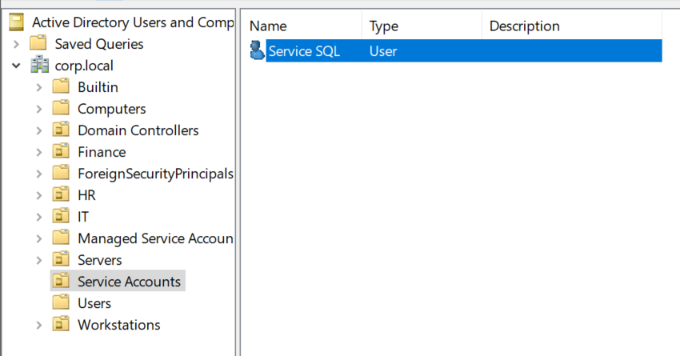
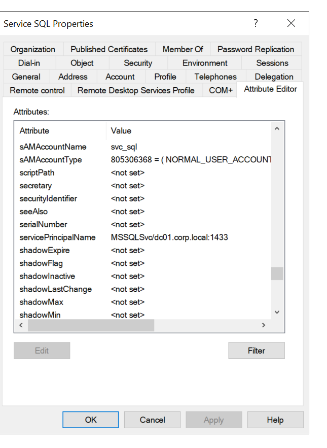
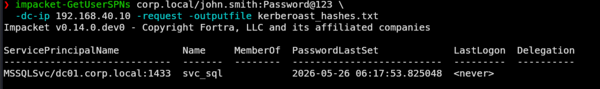
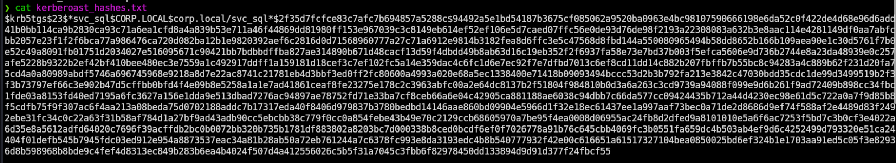
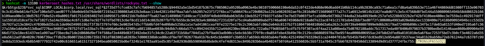
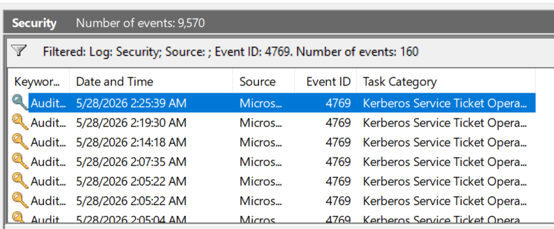
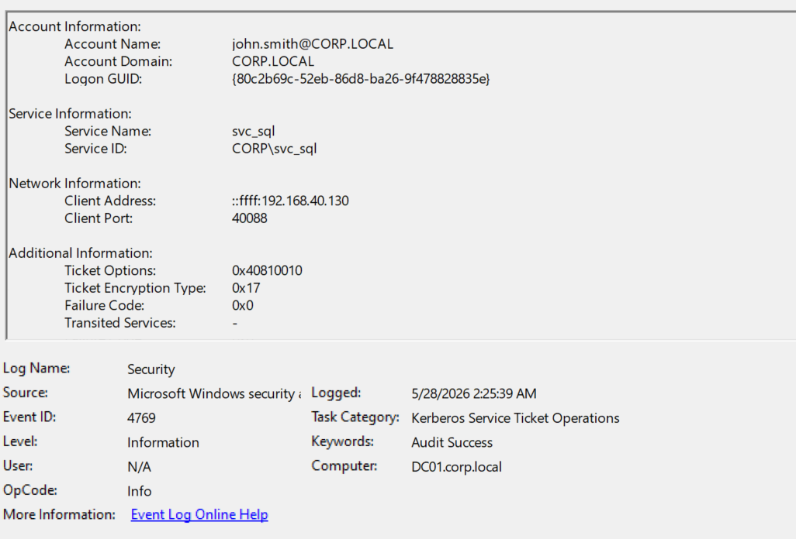
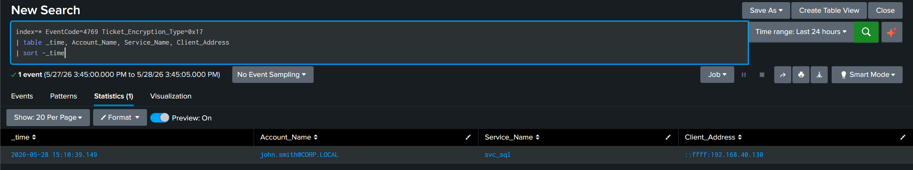

# Kerberoasting

A credential-access technique that abuses normal Kerberos behaviour. Any authenticated domain user can request a service ticket (TGS) for an account with a Service Principal Name (SPN). The ticket is encrypted with the service account's password hash, which can then be cracked offline. No exploits, no admin rights, no failed logons.

## MITRE ATT&CK Mapping (TTPs)

| Tactic            | Technique                                      | ID        |
| ----------------- | ---------------------------------------------- | --------- |
| Credential Access | Steal or Forge Kerberos Tickets: Kerberoasting | T1558.003 |

## Setup

A service account (`svc_sql`) was created in the Service Accounts OU as a target. An SPN (`MSSQLSvc/dc01.corp.local:1433`) was registered on it via the Attribute Editor, which is what makes the account roastable.





## Attack

### Step 1: Request the TGS with Impacket (T1558.003)

From Kali, as a normal domain user (`john.smith`):

```bash
impacket-GetUserSPNs corp.local/john.smith:Password@123 \
  -dc-ip 192.168.40.10 -request -outputfile kerberoast_hashes.txt
```

GetUserSPNs enumerated accounts with SPNs and requested a service ticket for each. The output identified `svc_sql` with SPN `MSSQLSvc/dc01.corp.local:1433`. The `-request` flag is what actually pulls the crackable hash; without it, only the SPN list is returned.



### Step 2: View the captured hash

```bash
cat kerberoast_hashes.txt
```

The hash starts with `$krb5tgs$23$` — the `23` is etype 23 (RC4-HMAC), which is the fast-to-crack encryption type that attackers prefer.



### Step 3: Crack offline with Hashcat

```bash
hashcat -m 13100 kerberoast_hashes.txt /usr/share/wordlists/rockyou.txt
```

Mode 13100 is Kerberos 5 TGS-REP etype 23, matching the captured hash format.

The svc_sql password (`STRONG@PASS@321`) is strong and not in rockyou, so the initial run exhausted the wordlist without cracking. The password was then added to a custom wordlist to demonstrate the crack chain end-to-end. This is itself a useful finding: a service account with a genuinely strong password resists offline cracking, which is the actual mitigation against Kerberoasting (the ticket is captured, but useless without a crackable password).



## Detection

### Event 4769 (Kerberos service ticket was requested)

Every TGS request generates 4769. The challenge is volume: 160 of these existed in the lab from normal DC activity, so a raw filter on 4769 isn't useful. The IOC is the **encryption type**.

The detail of the attack event showed:

- Account: `john.smith@CORP.LOCAL` (the user account that requested the ticket)
- Service Name: `svc_sql` (the target service account)
- Ticket Encryption Type: `0x17` (RC4-HMAC)
- Client Address: `::ffff:192.168.40.130` (Kali)

`0x17` is the signal. Modern AD defaults to AES (`0x12`), so an RC4 ticket request for a user account is suspicious.





### Splunk

```spl
index=* EventCode=4769 Ticket_Encryption_Type=0x17
| table _time, Account_Name, Service_Name, Client_Address
| sort -_time
```

The filter on encryption type cuts the noise and surfaces the attack ticket cleanly. The result shows `john.smith@CORP.LOCAL` requesting a TGS for `svc_sql` from `192.168.40.130`.



## Summary

| Step          | TTP       | Event ID     |
| ------------- | --------- | ------------ |
| Request TGS   | T1558.003 | 4769         |
| Offline crack | T1558.003 | — (no event) |

The detection lesson: Kerberoasting generates only valid Kerberos traffic. No failed logons, no lockouts, no obvious errors. The only on-network signal is the RC4 ticket request, and the cracking happens offline with no further interaction with the DC. Filtering 4769 by `Ticket_Encryption_Type=0x17` (and excluding machine accounts) is the reliable hunt.

The mitigation lesson: a strong service-account password defeats the attack even when the ticket is captured. The svc_sql password resisting rockyou demonstrates this directly.
