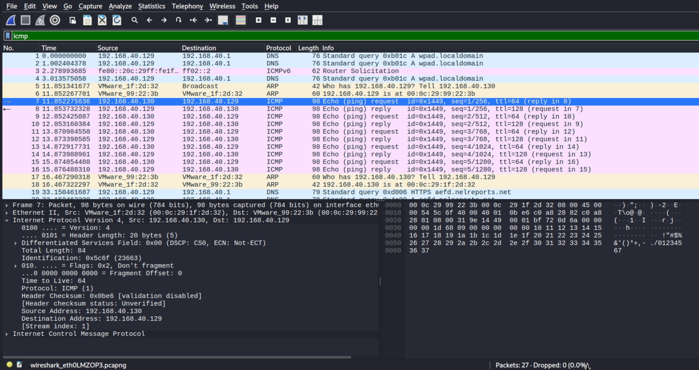
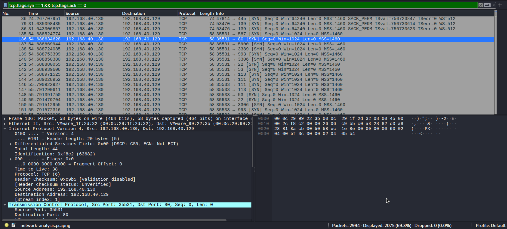
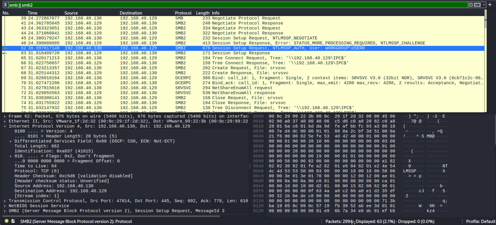
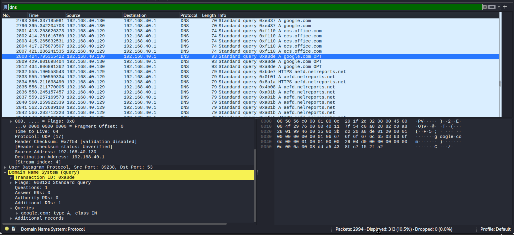
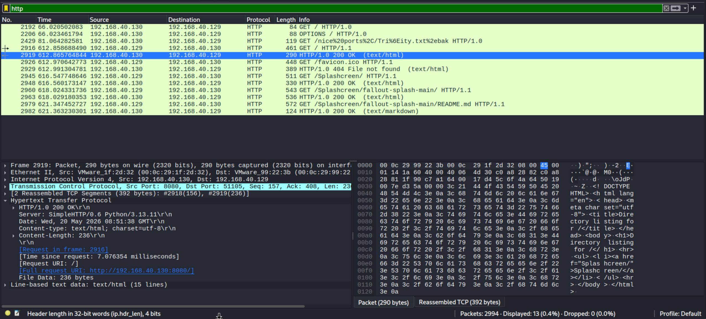
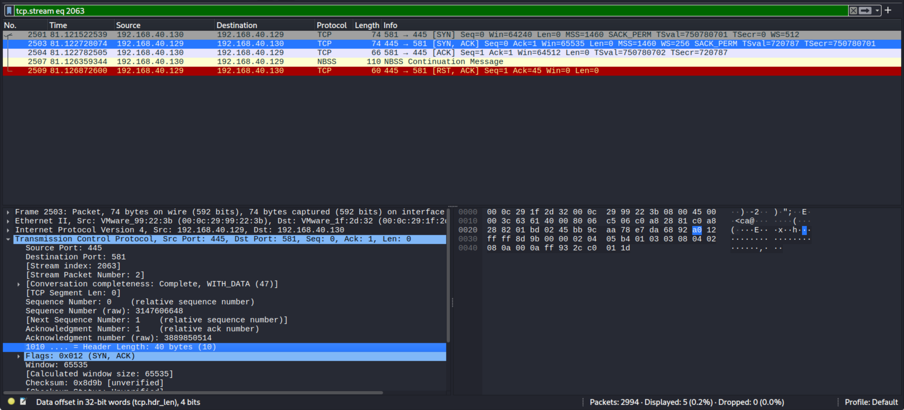
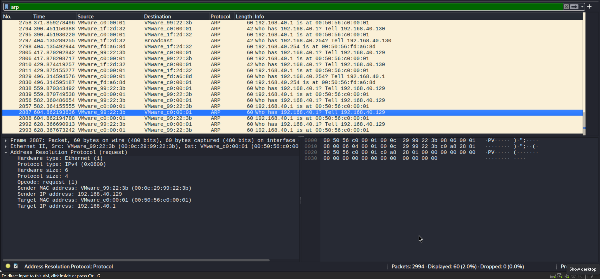

# Network-Traffic-Analysis

## Objective

The purpose of this project was to analyze network traffic which was generated between Kali Linux as attacker and Windows as target within a controlled lab environment using Wireshark.

The projects foccused on identifying and analyzing:

- ICMP traffic
- DNS traffic
- HTTP traffic
- SMB authentication traffic
- TCP handshakes
- Nmap reconnaissance scans
- ARP communication

This project demonstrates foundational network analysis and SOC investigation skills.

---

## Lab Setup

### Attacker Machine

- Kali Linux
- IP Address: `192.168.40.130`

### Target Machine:

- Windows 11
- IP Address: `192.168.40.129`

### Network

- VMware Host-only Network

---

## Tools Used

- Wireshark
- Namp
- smbclient
- enum4linux
- Kali Linux Version: 6.18.5
- Windows 11 Version: 10.0.26200

---

## Steps Performed

### 1. Connectivity Testing

ICMP ping traffic was generated between Kali and the Windows target machine.

Command used:

```bash
ping -c 5 192.168.40.129
```

---

### 2. Network Reconnaissance

Nmap SYN scanning was performed to identify open ports and services running on the target system.

Command used:

```bash
nmap -sS 192.168.40.129
```

---

### 3. SMB Enumeration

SMB shares and authentication traffic were analyzed using smbclient and enum4linux.

Commands used:

```bash
smbclient -L //192.168.40.129 -U USERR
```

```bash
enum4linux 192.168.40.129
```

---

### 4. DNS Traffic Analysis

DNS queries were generated and inspected to analyze domain resolution traffic.

Example domain queired:

```text
google.com
```

---

### 5. HTTP Traffic Analysis

HTTP traffic was generated wuing a local Python HTTP server to inspect unencrypted web traffic.

Command used:

```bash
python3 -m http.server 8080
```

---

### 6. TCP Handshake Analysis

TCP three-way handshakes were inspected to observe connection establishment behaviour between systems.

Wireshark filters used:

```text
tcp.flags.syn==1 && tcp.flags.ack==0
```

```text
tcp.stream eq 2063
```

---

### 7. ARP Traffic Analysis

ARP requests and responses were analyzed to observe local network MAC address resolution.

Wireshark filter used:

```text
arp
```

---

## Screenshots

### ICMP Traffic Analysis



### Nmap SYN Scan Traffic



### SMB Authentication Traffic



### DNS Traffic Analysis



### HTTP Traffic Analysis



### TCP Handshake Analysis



### ARP Traffic Analysis



## Conclusion

This lab provided a practical experience with packet analysis and protocal inspection using Wireshark. The project strengthened my understanding of network communication, reconassicance detection and traffic investigation techinques commonly used in SOC and cybersecurity operations.
