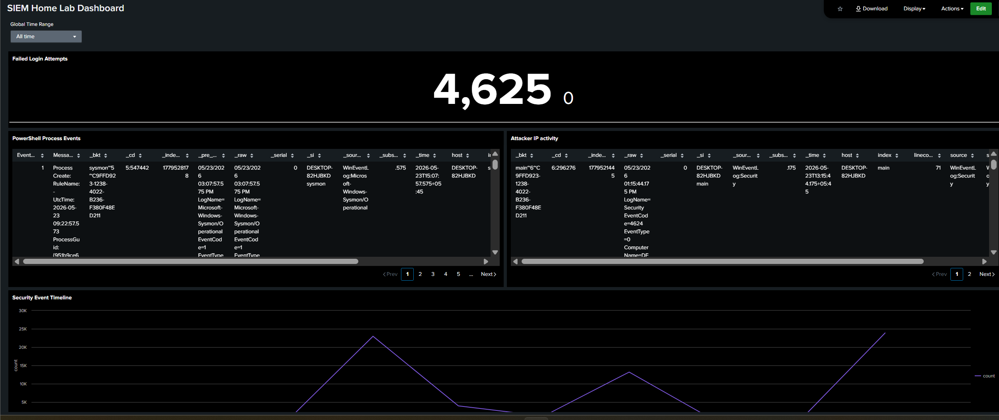
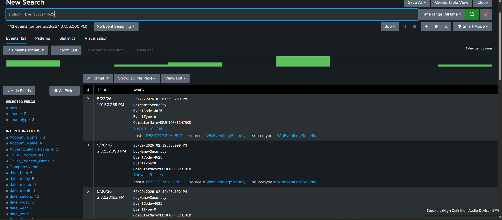
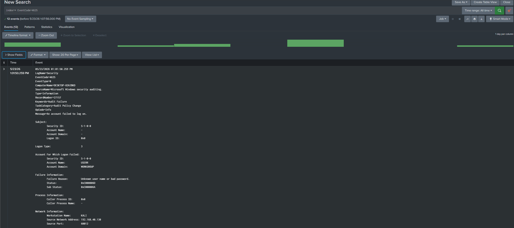
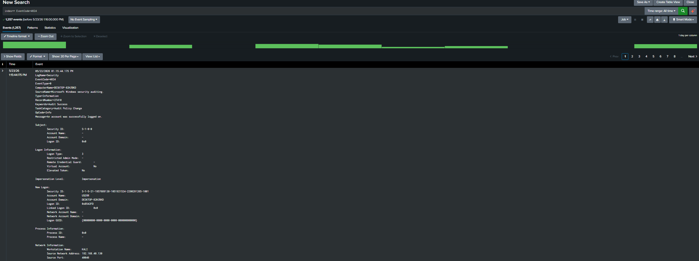
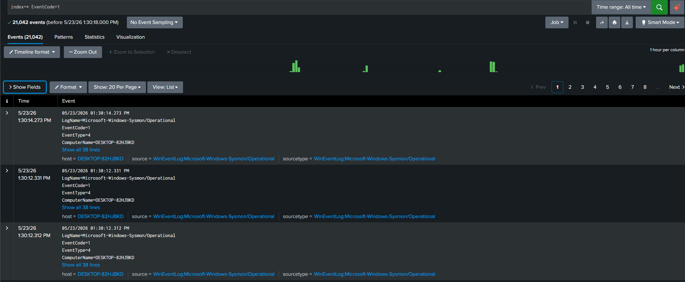
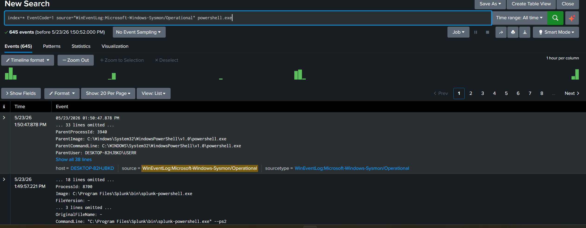
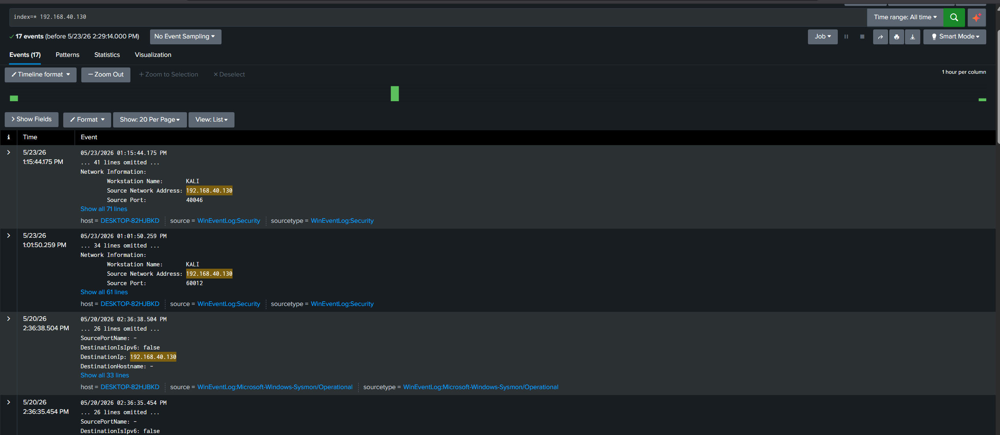
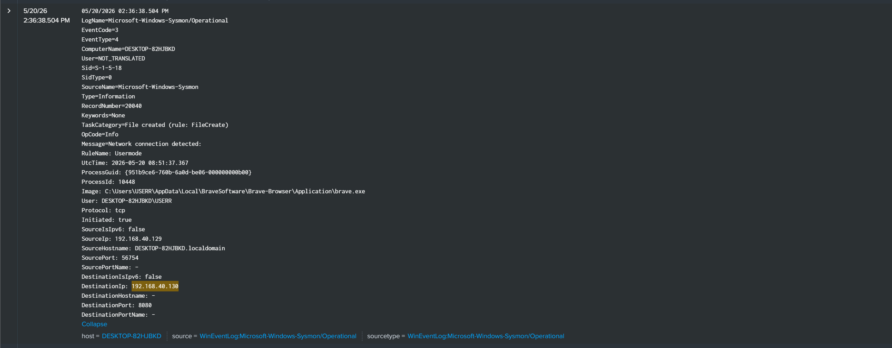
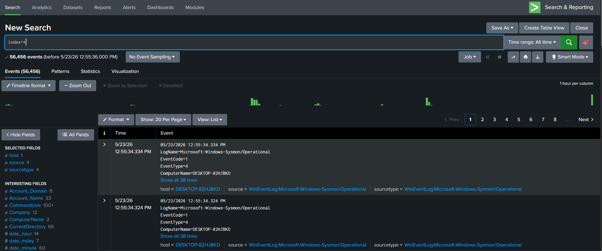

# SIEM Home Lab

## Project Overview

This project demonstrates the creation of a SIEM home lab using Splunk Enterprise, Sysmon, and Windows Event Logging within an isolated VMware environment.

The lab was used to collect Windows security logs, monitor endpoint activity, detect suspicious events, and analyze attacker-related activity from a Kali Linux system.

---

# Lab Environment

## Systems Used

| System             | Purpose                 |
| ------------------ | ----------------------- |
| Windows 11         | Target machine          |
| Kali Linux         | Attacker machine        |
| Splunk Enterprise  | SIEM platform           |
| Sysmon             | Endpoint telemetry      |
| VMware Workstation | Virtualization platform |

---

# Tools Used

- Splunk Enterprise
- Sysmon
- Windows Event Viewer
- VMware Workstation
- Kali Linux
- Nmap
- PowerShell

---

# Project Structure

```text
SIEM-Home-Lab/
│
├── README.md
├── findings.md
├── alert.md
│
├── screenshots/
│   ├── splunk-dashboard.png
│   ├── failed-login-search.png
│   ├── event-4625-details.png
│   ├── event-4624-details.png
│   ├── sysmon-process-events.png
│   ├── powershell-events.png
│   ├── nmap-source-ip-search.png
│   ├── nmap-event-details.png
│   └── splunk-overview.png
│
├── detection-queries/
│   ├── failed-logins.spl
│   ├── powershell-detection.spl│
│   └── attacker-ip-detection.spl
│
├── logs/
│   ├── failed-login-sample.txt
│   ├── powershell-event-sample.txt
│   └── network-event-sample.txt
│
└── configs/
    ├── sysmon-config.xml
    └── inputs.conf
```

---

# Splunk Detection Queries

## Failed Login Detection

```spl
index=* EventCode=4625
```

---

## Successful Login Detection

```spl
index=* EventCode=4624
```

---

## Sysmon Process Creation Monitoring

```spl
index=* EventCode=1
```

---

## PowerShell Activity Detection

```spl
index=* EventCode=1 source="WinEventLog:Microsoft-Windows-Sysmon/Operational" powershell.exe
```

---

## Attacker IP Detection

```spl
index=* "192.168.40.130"
```

---

## Security Event Timeline

```spl
index=*
| timechart count
```

---

# Dashboard Panels

The following dashboard panels were created in Splunk:

- Failed Login Attempts
- PowerShell Process Events
- Attacker IP Activity
- Security Event Timeline

---

# Screenshots

## Splunk Dashboard



---

## Failed Login Search



---

## Failed Login Event Details (Event ID 4625)



---

## Successful Login Event (Event ID 4624)



---

## Sysmon Process Events



---

## PowerShell Detection Query



---

## Attacker IP Detection



---

## Network Connection Event Details



---

## Splunk Event Overview



---

# Skills Demonstrated

- SIEM deployment
- Splunk administration
- Sysmon configuration
- Windows event analysis
- Log analysis
- Detection engineering
- Threat monitoring
- Security monitoring
- Dashboard creation
- Event correlation
- Endpoint telemetry analysis

---

# Conclusion

This project demonstrated how SIEM can be used to centralize logs, monitor endpoint activity, and investigate security-related events within a controlled lab environment.

The lab provided a hands-on experience with Splunk, Sysmon, Windows event logging, and security event analysis workflows commonly used in SOC environments.
