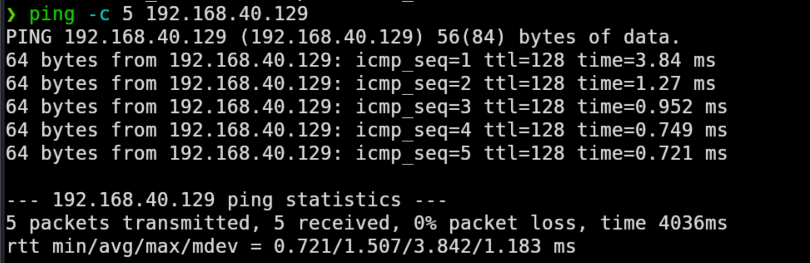
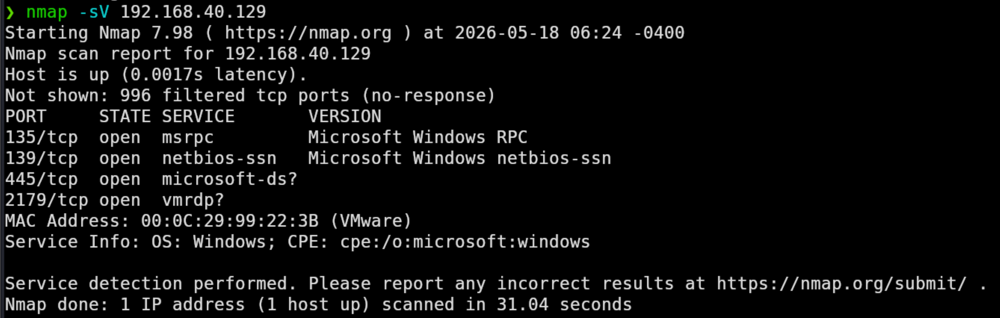
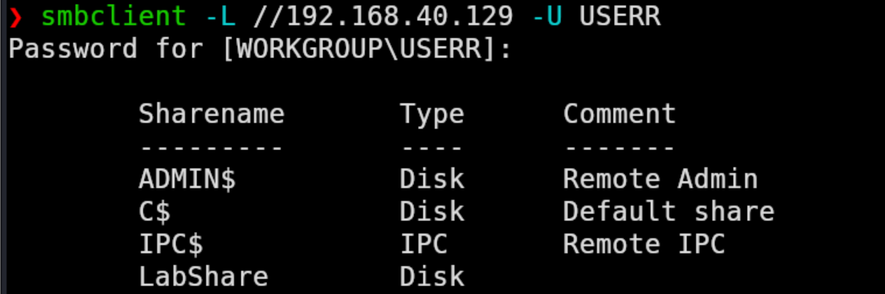
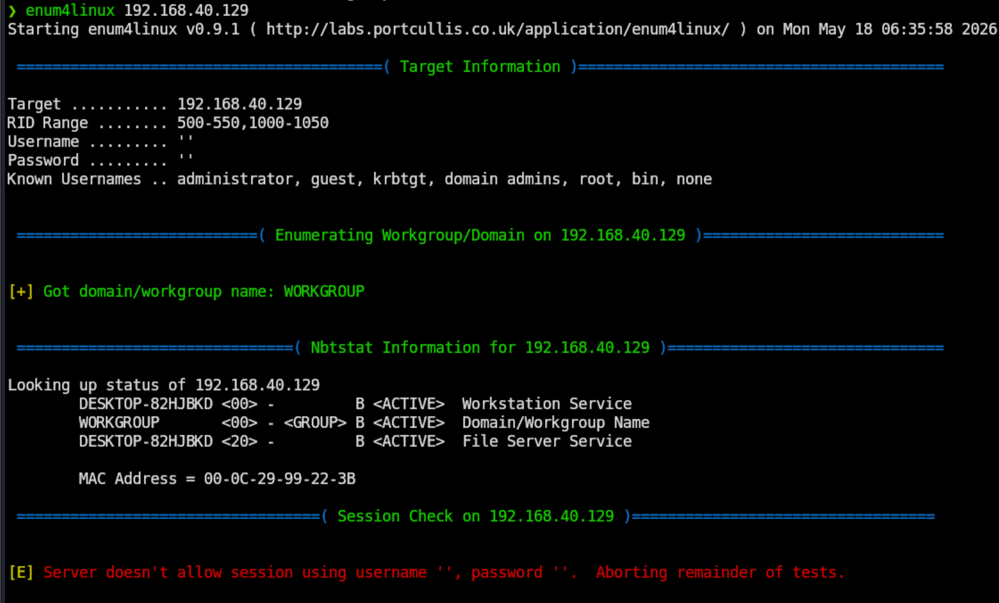

# SMB-Enumeration Lab

## Objective

The objective of this lab was to perform SMB enumeration and network reconnaissance within an isolated VMware lab using kali Linux and Windows 11. The lab focused on identifying exposed SMB services, verifying network connectivity and analyzing authentication behaviours during enumeration attempts.

---

## Lab Setup

### Infrastructure

- VMware workstation
- Kali Linux Virutal Machine
- Windows 11 Virtual Machine

### Network Configuration

- Host-ony isolated VM network
- Internal communication between Kali (`192.168.40.130`) and Windows (`192.168.40.129`)
- Controlled testing environment

---

## Tools Used

### Enumeration & Networking

- Nmap
- smbclient
- enum4linux
- ping

### Operating Systems

- Kali Linux Version: 6.18.5
- Windows 11 Version: 10.0.26200

## Steps Performed

### 1. Verified Network Connectivity

Connectivity between Kali Linux and the Windows host was verified using ICMP ping request.

Command used:

```bash
ping -c 192.168.40.129
```

---

### 2. Performed Service Enumeration

Namp service detection was used to identify open ports and exposed services on the Windows hosts.

Command used:

```bash
nmap -sV 192.168.40.129
```

Discovered service included:

- TCP 135 (MSRPC)
- TCP 139 (NetBIOS-SSN)
- TCP 445 (Microsoft-DS / SMB)

---

### 3. Enumerated SMB shares

SMB shares were enumerated using authenticated SMB access.

Command used:

```bash
smbclient -L //192.168.40.129 -U USERR
```

Discovered shares included:

- ADMIN$
- C$
- IPC$
- LabShare

---

### 4. Performed SMB/NetBIOS Enumeration

Additional SMB and NetBIOS enumeration was conducted using enum4linxu.

Command used:

```bash
enum4linux 192.168.40.129
```

The enumeration identified:

- WORKGROUP name
- Windows hostname
- Active file server service
- SMB session restriction

---

## Screenshots

### Ping Connectivity



### Nmap SMB Scan



### SMB Share Enumeration



### enum4linux Enumeration Results



---

## Findings

- Network connection between Kali Linux and Windows 11 was successfully established.
- SMB-related services were exposed on ports 139 and 445.
- Authenticated SMB enumeration successfully revealed available network shares.
- Administrative shares and a custom lab share were identified.
- The target exposed NetBIOS and workgroup information during enumeration.
- Anonymous SMB session attempts were denied, which indicated authentication enforcement.

---

## Security Analysis

The Windows host exposed SMB services to the internal network, increasing visibility and potential attack surface exposure. SMB enumeration allowed discovery of available shares and system information after authentication.

However, the system correctly restricted anonymous SMB sessions preventing unauthenticated enumeration attempts. This demonstrates the importance of enforcing SMB authentication and limiting unnecessary network exposure.

---

## Conclusion

This lab demonstrated basic SMB enumeration techniques within a controlled environment using Kali Linux and Windows 11. The project provided hands-on experience with service discovery, SMB share enumeration, and network reconnaissance workflows commonly used in security operations and penetration testing environments.
